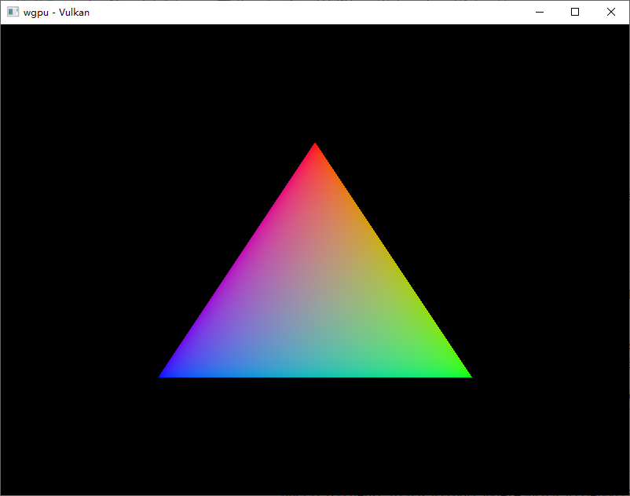

# wgpu-hello-triangle-spirv

A hello-triangle example using SpirV shaders in [wgpu](https://github.com/gfx-rs/wgpu).

The example uses shaders from
[Vulkan Tutorial](https://vulkan-tutorial.com/Drawing_a_triangle/Graphics_pipeline_basics/Shader_modules).
and Vulkan backend.

The purpose of this repo is to give a direct example of using SpirV in `wgpu`,
since it's not obvious for newcomer of `wgpu`. 

## Quick Q&A

Q: How to use a SpirV shader in `wgpu`?

A: Create shader source with `wgpu::util::make_spirv` or include it
statically with `wgpu::include_spirv!`.

Please see comments in `src/main.rs` for more details. 

## Run example

``` shell
cargo run
```

## Screenshot



## Convert GLSL to SpirV

Install [naga-cli](https://github.com/gfx-rs/naga#conversion-tool):

``` shell
cargo install naga-cli
```

Convert shaders:

``` shell
naga shader.frag frag.spv
naga shader.vert vert.spv
```

## Known Issue

* Validation Error: [ VUID-VkSwapchainCreateInfoKHR-imageExtent-01274 ] -
https://github.com/gfx-rs/wgpu/issues/1958 
